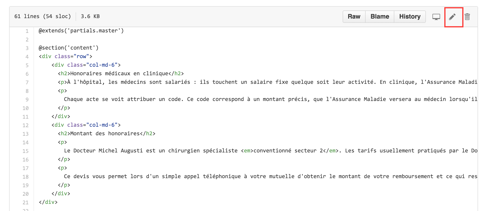
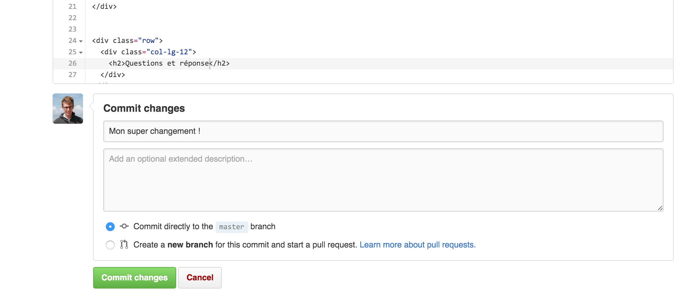

# Modifier le texte des pages
Cliquer sur le lien correspondant à la page que l'on veut modifier.

Liste des pages :
- **Accueil**: [resources/views/welcome](resources/views/welcome.blade.php)
- **Consultations**: [resources/views/consultations](resources/views/consultations.blade.php)
- **Contact**: [resources/views/contact](resources/views/contact.blade.php)
- **Équipe**: [resources/views/equipe](resources/views/equipe.blade.php)
- **Hospitalisation**: [resources/views/hospitalisation](resources/views/hospitalisation.blade.php)
- **Informations légales**: [resources/views/juridique](resources/views/juridique.blade.php)
- **Sites opératoires**: [resources/views/sites-operatoires](resources/views/sites-operatoires.blade.php)

Cliquer sur le crayon, dans la barre en haut à droite pour éditer le texte.

Descendre jusqu'en bas de page, et remplir un message explicatif du changement.

Cliquer sur le gros bouton vert et attendre 1 minute ou 2 pour voir les changements en ligne.

# En cas de problème
Attention à ne pas enlever les balises autour du texte, sinon tout ceci va être cassé.

Dans tous les cas, me contacter ;)
